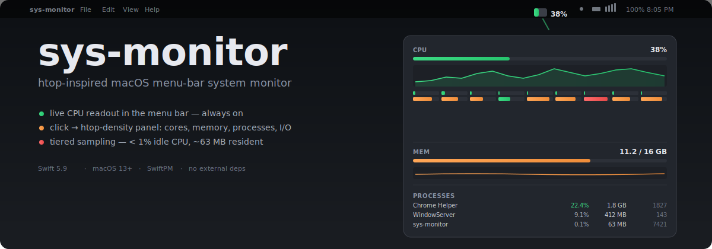

<div align="center">
  
</div>

<h1 align="center">sys-monitor</h1>

<p align="center">
  An htop-inspired macOS menu-bar system monitor — live CPU, memory, processes,
  network and disk, in a tiny, sub-1%-CPU agent.
</p>

<p align="center">
  
  
  
  
  
  
</p>

---

## What it is

A small, native macOS app that lives entirely in the menu bar. The icon shows
a **live CPU readout** (mini usage bar + tabular `%`). Clicking it drops a
SwiftUI panel with the things htop puts on one screen — overall + per-core
CPU, memory + swap + pressure, top processes by CPU or memory, network and
disk throughput — plus rolling 60-second sparklines for CPU and memory.

It's designed to be **left running all day** without measurably contributing
to the load it measures. The architecture is two tiers of sampling: a cheap
always-on tick that feeds only the bar glyph and the history graphs, and an
expensive tick that runs **only while the panel is open**. Process
enumeration, per-core CPU walks, and network/disk I/O reads never happen in
the idle tier.

Built as a SwiftPM executable wrapped into a `.app` bundle by a single
`build.sh`. No external dependencies — just AppKit, SwiftUI, Combine, IOKit,
and Darwin (mach / sysctl / libproc). One binary, ad-hoc-signed for personal
use; no sandbox (deliberate trade for unrestricted process enumeration).

---

## Quick start

```bash
git clone https://github.com/<your-fork>/sys-monitor.git
cd sys-monitor

# Build a release .app bundle (≈ 5 s) and assemble Contents/Info.plist
./build.sh release

# Or: build and launch
./build.sh release --run

# Move it where you want it (recommended for launch-at-login, future Phase 5):
cp -R sys-monitor.app ~/Applications/
open ~/Applications/sys-monitor.app
```

A gauge icon will appear in your menu bar. After ~2 seconds the first valid
CPU reading lands; click the icon to drop the panel. Click anywhere outside
the panel to dismiss.

### Quick sanity check (no UI)

A `--probe` mode runs the samplers headlessly for verification — prints five
1-second readings of overall CPU, per-core CPU, memory, plus the IOKit disk
spike verdict, then exits:

```bash
./build.sh release
.build/release/sys-monitor --probe
```

---

## Features

- **Live multi-metric menu-bar readout** — `[cpu]35% [memorychip]60% │ [⇅]42M ▲ [drive]2M ▼`.
  Each cell leads with an SF Symbol identity glyph; the CPU/MEM glyphs *are*
  load gauges (bottom-up fill in label color, switching to yellow at warn /
  red at critical). Pick any subset of CPU/MEM/NET/DISK in Settings.
- **htop-density panel** on click — CPU header bar, per-core meter strip (P/E
  asymmetry visible on Apple Silicon), memory + swap + pressure, system-wide
  network and disk throughput, 60-second history sparklines for CPU and
  memory (memory graph auto-zooms into its narrow range so steady-state isn't
  flat), and a top-25 process list.
- **Process list interactions:**
  - **Search** by name, case-insensitive
  - **App icons** for processes packaged as `.app` (Chrome, your editor, …);
    daemons / CLI binaries stay icon-less by design
  - **Click a row to expand** → executable path + buttons: `Focus` (brings
    the app forward, only for processes macOS classifies as regular apps),
    `Copy kill -TERM`, `Copy kill -9`, `Copy path` — all copy literal
    commands/strings to the clipboard
  - **EMA-smoothed ranking** — bottom of the list stops slot-machining
    because rank uses a 5-tick moving average; the displayed value is still
    the raw current %
  - **Freeze-on-hover** — pointer over the list pauses re-sorting
- **Tiered sampling** — `< 1%` idle CPU is real, not theoretical (see
  [docs/04-acceptance.md](docs/04-acceptance.md) for the 5-minute measurement).
- **Live settings** — idle/open sampling cadence, menu-bar cells, process
  count and default sort, launch-at-login. Every control wired to live
  readers; no placeholders.
- **Pre-populated graphs** — idle tier keeps a shared CPU/MEM history ring
  buffer so opening the panel shows existing trends *immediately* rather than
  starting blank and filling over a minute.
- **Sleep / wake re-baseline** — `NSWorkspace.didWakeNotification` drops
  all baselines so the first sample after wake never displays a multi-hour
  cross-gap delta as a "CPU 4000%" spike.

---

## Architecture (the short version)

```
┌──────────────── sys-monitor.app (.accessory, LSUIElement) ────────────────┐
│                                                                             │
│  AppKit shell (main thread)            Sampling core (serial bg queue)     │
│  ┌─────────────────────────┐           ┌──────────────────────────────┐    │
│  │ NSStatusItem            │           │ SamplingCoordinator          │    │
│  │  └ button.image =       │  tier     │  ├ idle / open timers        │    │
│  │    GlyphRenderer.draw() │  cmds     │  ├ rate math vs measured Δt   │   │
│  │ NSPanel + NSHostingView │◀─────────▶│  ├ re-baseline on tier-switch │   │
│  │  └ SwiftUI PanelRootView│           │  └ samplers (raw counters):   │   │
│  └────────────┬────────────┘           │     CPU·Mem·Process·Net·Disk  │   │
│               │ retained Combine sink   └──────────────┬───────────────┘    │
│               │   (one redraw/tick)                    │ MainActor.run hop  │
│  ┌────────────▼────────────────────────────────────────▼─────────────┐    │
│  │ MetricsStore : ObservableObject @MainActor                         │    │
│  │   @Published var snapshot: MetricsSnapshot   (Sendable value)      │    │
│  └────────────────────────────────────────────────────────────────────┘    │
└──────────────────────────────────────────────────────────────────────────┘
```

A few load-bearing decisions:

- **Hybrid shell, not `MenuBarExtra`.** `MenuBarExtra(.window)` was the
  initial pick but its label can't reliably render a live custom glyph (mini
  bar + `%` + color ramp). `NSStatusItem` with a per-tick `NSImage` does it
  crisply; the dropdown is still 100% SwiftUI via `NSHostingView`.
- **Borderless `NSPanel` subclass** with `canBecomeKey = true` and
  `canBecomeMain = false`, plus `.nonactivatingPanel`. The panel takes key so
  scroll / sort-toggle / hover route normally; the *app* stays `.accessory`
  so no Dock icon ever appears.
- **`resignKey` is not a dismiss trigger.** That's the subtle part: a global
  `NSEvent` click-outside monitor dismisses; `windowDidChangeOcclusionState`
  drops to idle tier without dismissing. Occlusion, Space switches, and
  Settings activation all fire `resignKey` but must *keep* the panel.
- **`RingBuffer` is a value-type `struct`.** No shared mutable buffer between
  threads. The coordinator owns the authoritative history on its background
  queue and copies the current window into each `Sendable` snapshot. The only
  cross-thread transfer is one `@MainActor.run { store.snapshot = snap }` per
  tick, with `Equatable`-by-`generation` so SwiftUI diffs cheaply.
- **All rate metrics divide by *measured* elapsed time**
  (`clock_gettime(CLOCK_MONOTONIC)`), never the nominal cadence. Cadence
  changes, tier switches, and timer jitter are correct by construction.
- **Hygiene rules baked in:** `vm_deallocate` on every
  `host_processor_info` array (the silent-leak trap), two-call sysctl size
  probes for `NET_RT_IFLIST2` (the silent-truncation trap), `PROC_PIDTASKINFO`
  alone for processes (drops `proc_pid_rusage` — redundant, doubles syscalls).

---

## Performance

Measured on an 18-core Apple Silicon (M-series) Mac, macOS 26.5, panel closed,
5-minute window, sampled at 1 Hz (300 samples):

| Metric | Value | Budget | Result |
| --- | --- | --- | --- |
| Mean CPU | 0.775% of one core | < ~1% | ✓ |
| Median CPU | 0.1% | — | ✓ |
| Panel-closed slices | 0.16–0.55% | < ~1% | ✓ |
| RSS, end of run | 63 MB | ≤ 80 MB | ✓ |
| RSS, Δ over 5 min | +1 MB | ≈ 0 | ✓ (no leak) |
| Disk IOKit spike | PLAUSIBLE | — | ✓ (disk row stays in v1) |

The non-trivial tail (`p95 = 4.4%`, `max = 6.6%`) is clustered into
30-second windows, not random — it's the *open tier* doing process
enumeration of ~300+ PIDs while the panel was open during the measurement.
That's the architecture being visible in the data: bursts of activity
exactly when the panel is in use, near-zero otherwise.

Full breakdown, including per-slice means, in
[`docs/04-acceptance.md`](docs/04-acceptance.md).

---

## Documentation

The project was built planning-first in three reviewed stages — each doc
was drafted, critiqued by a sub-agent reviewer, and revised before the next
stage started.

| Document | Purpose |
| --- | --- |
| [`docs/01-spec.md`](docs/01-spec.md) | What sys-monitor is — goals, non-goals, requirements (FRs + NFRs), data sources, acceptance criteria |
| [`docs/02-behavior.md`](docs/02-behavior.md) | How it behaves — every state, every flow, the sampling state machine (idle ↔ open tier, re-baseline triggers) |
| [`docs/03-implementation.md`](docs/03-implementation.md) | How it's built — module breakdown, the sampler protocol, the `MetricsStore` publish path, the borderless `NSPanel` event routing, phased build sequence |
| [`docs/04-acceptance.md`](docs/04-acceptance.md) | Phase-6 acceptance sweep against AC-1 … AC-8, the 5-minute idle-CPU measurement, what shipped vs what's deferred |

---

## Project layout

```
sys-monitor/
├── Package.swift           # SwiftPM manifest (one executable target)
├── build.sh                # compile → assemble .app → ad-hoc codesign
├── Resources/
│   └── Info.plist          # LSUIElement, bundle id, min OS
├── Sources/sys-monitor/
│   ├── main.swift          # NSApplication bootstrap, --probe entry
│   ├── AppDelegate.swift
│   ├── Probe.swift         # headless sampler verification (--probe)
│   ├── Model/              # Raw, Samples, Metric<T>, MetricsSnapshot, MetricsStore
│   ├── Sampling/           # CPU/Mem/Process/Network/Disk samplers, RateMath, RingBuffer, SamplingCoordinator
│   ├── Shell/              # StatusItemController, GlyphRenderer, DropPanel, PanelController
│   └── UI/                 # PanelRootView, GraphView, DesignTokens
├── assets/
│   ├── cover.svg           # this README's hero
│   └── banner.txt          # rendered terminal banner (see below)
└── docs/                   # the four design docs
```

There's also a generated banner you can `cat assets/banner.txt` for the
terminal view of the same project shape.

---

## Status & what isn't shipped yet

Phases 0–7 shipped, plus the Phase-6 acceptance sweep and the post-Phase-6
icon-led bar redesign. Explicitly deferred:

- **GPU in the bar.** Apple-Silicon GPU sampling needs `IOReport` (private
  framework) or Metal SPI; the result is fragile across macOS versions. The
  spec marks GPU as N1 from the start. Candidate for v2 after a spike.
- **Pin a process by name** (always show it at top of the list). UX harder
  than it looks for processes like "Chrome Helper" that have many instances
  — needs design before code.
- **Occlusion / Space-switch / display-disconnect handling.** Click-outside
  dismiss is wired; demoting to idle tier without dismissing on occlusion is
  a few-line follow-up.
- **Reduce Motion / Increase Contrast plumbing** for the panel sections.
  Per-process VoiceOver labels are wired; the rest of NFR-9 isn't.
- **Distribution & notarization.** Personal/local use only by design;
  there's no `LICENSE` file or signing identity yet.

See [`docs/04-acceptance.md`](docs/04-acceptance.md) §6 for the full
deferred-items list.

---

## License

No license has been added yet — this is currently a personal/local-use
project, ad-hoc-signed for the author's machine. If you intend to fork or
distribute, please open an issue first.

---

## Acknowledgements

- [`htop`](https://htop.dev/) — the interaction model and information-density
  target.
- [`exelban/stats`](https://github.com/exelban/stats) — the canonical
  open-source macOS menu-bar system monitor in Swift; reference for the
  mach-API sampling patterns.
- The Apple Developer Forums threads on `host_processor_info` /
  `IOBlockStorageDriver` / `proc_pidinfo` — collectively, the only honest
  source on which of these APIs actually work from user space without
  the sandbox.
